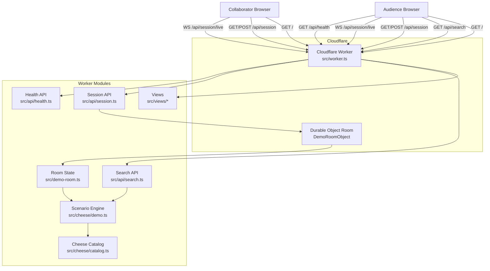

# Application Architecture

This document explains how the `french-cheese-shop-demo` application is assembled at a system level.

It complements:

- `ARCHITECTURE.md` for repo-wide rules and documentation conventions
- `specs/cheese-demo/spec.md` for feature behavior and guardrails
- `docs/adrs/ADR-018-replace-supervisor-search-with-a-deterministic-cheese-demo.md` for the key architecture change

## Summary

The application has one runtime path:

1. A Cloudflare Worker that serves the demo UI, deterministic JSON search API,
   and room-session endpoints backed by one Durable Object per room.

The Worker does not depend on remote AI services, private data imports, or runtime admin configuration. The ranking logic operates over a committed French cheese catalog so the live presentation stays predictable.

## System Diagram

## Runtime Flow

### 1. Worker Entry

`src/worker.ts` is the only deployed entrypoint.

It routes:

- `GET /` to the demo page
- `GET /styles.css` to generated CSS
- `GET /app.js` to the browser script
- `GET /api/search` to the JSON search endpoint
- `GET /api/health` to a minimal health response

Shared response headers and CSP come from `src/views/shared.ts`.

### 2. Search Request Path

`GET /api/search?q=...&scenario=...&audience=...&season=...&shopState=...&backend=...` flows through these modules:

1. `src/api/search.ts` validates the query length and normalizes the scenario parameter.
2. `src/cheese/demo.ts` parses the vague request plus any audience refinement text into explicit signals.
3. `src/cheese/catalog.ts` provides the deterministic cheese records used for scoring.
4. `src/cheese/demo.ts` scores the catalog differently for baseline, challenge 1, challenge 2, and challenge 3, while applying any shared world-context overlay from the foldable right-side `Context` container. The season overlay changes suitability signals, shop state changes effective stock pressure, and the optional backend toggle can switch between the default rules engine and a local LLM-style contrast mode.

The current scenario shifts are:

- `baseline`: surface wording and direct cheese similarity only
- `challenge-1`: explicit hidden requirements change the ranking
- `challenge-2`: extra context and product data cues change the ranking
- `challenge-3`: evaluation checks supplement ranking with quality criteria

### 3. Browser Runtime

`src/views/home.ts` renders one page shell with:

- a shared customer-request search input
- four tabs for baseline and the three challenges
- a challenge-specific audience textarea
- a results list and a teaching-insights panel

`src/views/home-script.ts` handles:

- room join, lecturer claim, audience-link sharing, and room reset controls
- local-only URL synchronization for `room` and explicit `Context` drawer open state
- debounced shared room updates through `/api/session`
- live room snapshot synchronization over `/api/session/live`
- client-side rendering of result cards, insights, evaluation checks, collaboration status, and lecturer-only query plus challenge controls

### 4. Room Coordination Path

`GET /api/session?room=...`, `POST /api/session?room=...`, and
`GET /api/session/live?room=...` flow through these modules:

1. `src/api/session.ts` resolves the requested room and forwards room traffic to
   the configured Durable Object.
2. `src/demo-room-object.ts` stores canonical room state, serializes command
   application, and broadcasts per-client snapshots to connected browsers.
3. `src/demo-room.ts` defines the room state shape, validates commands, derives
   accumulated audience inputs, and reuses `searchDemoCatalog()` to compute the
   deterministic results embedded in each room snapshot.

Shared room state includes the current query, active challenge, accumulated
audience inputs, world context, backend mode, room version, and one claimed
lecturer token for lecturer-only actions. Room snapshots also include access
flags for the current client so the browser can distinguish between lecturer-only
query/challenge controls and collaborative audience/context inputs. Local browser
state such as expanded result cards remains outside the shared room model.

## Data Model

The committed cheese record shape lives in `src/cheese/catalog.ts` as `CheeseRecord`.

The main fields are:

- `cheeseId`
- `name`
- `region`
- `milkType`
- `style`
- `textures`
- `pairings`
- `servingContexts`
- `intensity`
- `priceEur`
- `stock`
- `blurb`

## Key Configuration

Defined through `wrangler.jsonc`:

- Worker name
- entry module
- Durable Object binding and migration for room coordination
- generated CSS build step

No remote bindings or secret-backed runtime controls are required for the current demo.

## Code Layout

The source tree is split by responsibility:

- `src/api/` for JSON endpoints
- `src/cheese/` for the committed cheese catalog and scenario scoring logic
- `src/views/` for HTML, CSS, JS response helpers, and page rendering
- `scripts/` for local development helpers such as the Playwright server wrapper

## Intended Boundaries

The current architecture intentionally avoids:

- remote AI calls in the live demo path
- private import flows or admin-only configuration surfaces
- opaque ranking logic hidden inside route handlers

Those constraints come from the current spec and ADR set and should only change with explicit documentation updates.
